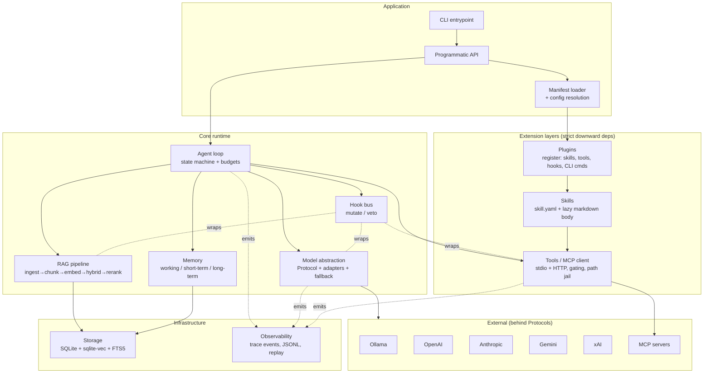
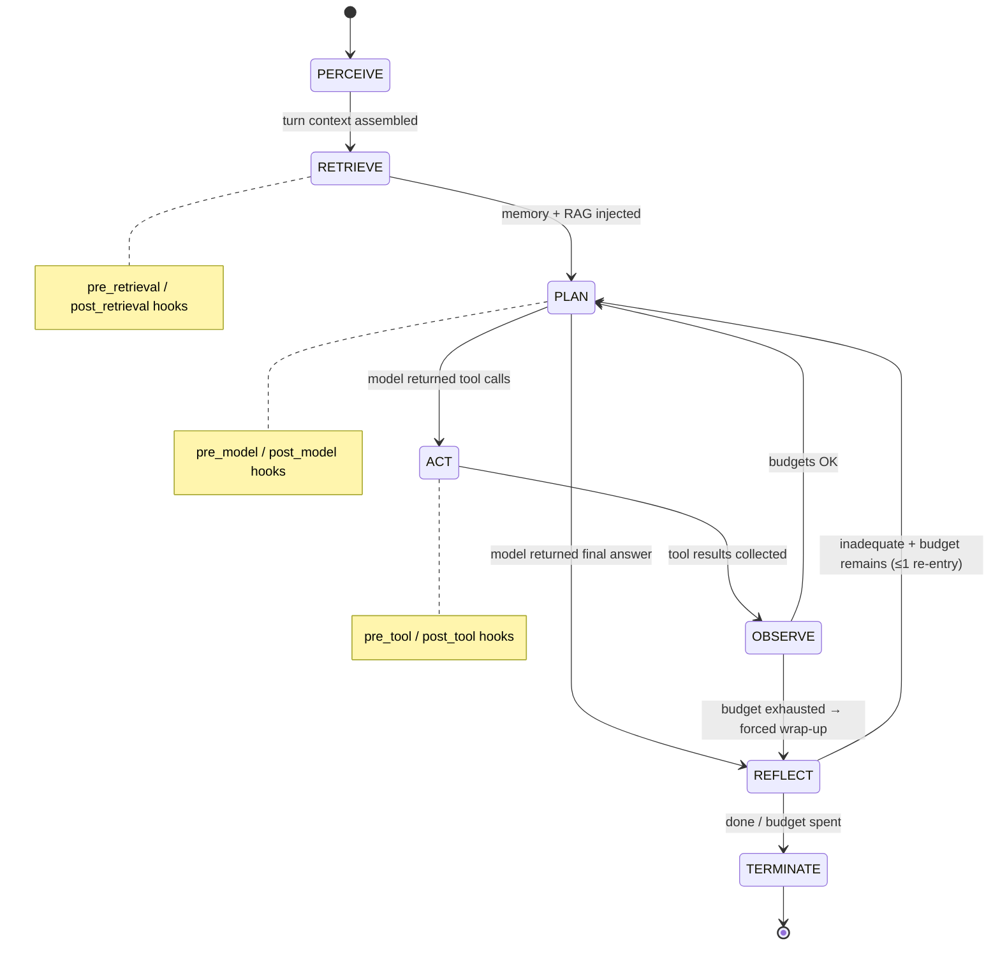
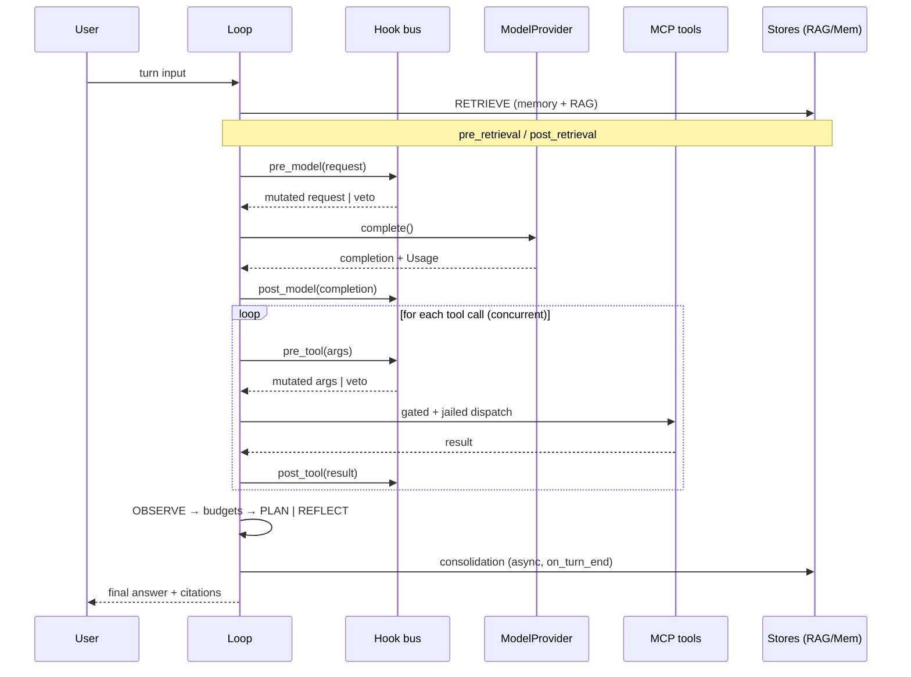

# Agent Loop Harness — Architecture

**Status:** Phase 0 deliverable. No code exists yet. This document is the contract the implementation phases build against; if a later phase contradicts it, the phase stops and this document is amended first.

---

## 1. Scope

A local-first, model-agnostic agent loop framework. Python 3.11+, asyncio-native, typed throughout (`typing.Protocol` for seams, pydantic v2 for every serialized schema). Zero infrastructure: the only persistence is SQLite (+ `sqlite-vec`, FTS5) and JSONL trace files. Ships a CLI entrypoint and a programmatic API.

Out of scope for v1 (explicitly): multi-agent delegation/orchestration, remote deployment, GUI, non-SQLite stores.

## 2. Assumptions (flagged for confirmation)

Stated per the ground rules; each is reversible until its owning phase begins.

| # | Assumption | Owning phase |
|---|---|---|
| A1 | Package name `agentloop`, distribution `agent-loop-harness`, `src/` layout, `uv` + `pyproject.toml`, pytest + pytest-asyncio. | 1 |
| A2 | MCP wire protocol via the official `mcp` Python SDK, wrapped behind our own `MCPTransport` Protocol. MCP is a spec, not a vendor; hand-rolling JSON-RPC buys nothing. Our code never imports `mcp` outside `agentloop/tools/mcp/`. | 4 |
| A3 | "Resolution order: manifest → env → CLI" is read as *increasing precedence*: env overrides manifest, CLI flags override both. Scalars replace; maps deep-merge; lists replace wholesale (no merge — merge semantics for lists are a footgun). | 1 |
| A4 | `agents[]` in the manifest declares named agent configurations (persona, model override, skill/tool subset). One agent is active per run (`--agent NAME`, default: first). Delegation between agents is post-Phase-11. | 1, 3 |
| A5 | Embeddings sit behind an `EmbeddingProvider` Protocol; default adapter is Ollama (`nomic-embed-text`). One embedding space per store; model name + dimension are recorded in DB metadata and a mismatch at startup forces reindex rather than silently mixing spaces. | 8 |
| A6 | Default reranker is Reciprocal Rank Fusion over the vector and BM25 result lists — deterministic, zero extra model calls. An optional LLM reranker implements the same `Reranker` Protocol. | 8 |
| A7 | Sandbox honesty: an MCP server is a foreign process; we cannot jail arbitrary servers from the client side. What we actually enforce: manifest allowlist gating, argument-level path-jail validation for filesystem-class tools, scrubbed launch environment for stdio servers, per-call timeouts, output size caps. This is a *trust boundary*, not containment, and is documented as such. | 4 |
| A8 | Hook veto semantics differ per event (post-events can't un-happen); the exact contract is the table in §9. | 5 |
| A9 | Cost accounting uses a shipped pricing data file (per-provider, per-model $/Mtok in/out), overridable in the manifest. Local models cost $0.00 but tokens are still counted against budget. | 2 |
| A10 | Runtime floor: Python 3.11 (TaskGroup, ExceptionGroup), SQLite with FTS5 compiled in (checked at startup with a clear error; macOS/Linux system builds qualify), `sqlite-vec` from PyPI. | 1, 8 |
| A11 | The full manifest JSON Schema and annotated example are Phase 1 deliverables per the phase gates; §5 here fixes the field inventory and semantics they must satisfy. | 1 |

## 3. System overview



### Dependency rules

1. **Extension direction:** `plugins → skills → tools`. A plugin may register skills and tools; a skill may invoke tools; a tool knows nothing above itself. No upward import, ever.
2. **Core direction:** everything may import `agentloop.types` and `agentloop.config`; nothing imports the CLI; adapters import their layer's Protocol, never each other.
3. **Observability inversion:** components do not import the observability package; they receive a `TraceEmitter` Protocol by injection. This kills the "everything depends on tracing" cycle and makes replay substitution trivial.
4. **Enforcement is mechanical, not aspirational:** `import-linter` layer contracts run in CI from Phase 1 onward. A violated layer fails the build.

## 4. Core internal types (`agentloop.types`)

All pydantic v2, all frozen where possible. These are the lingua franca every layer speaks; provider formats are translated *at the adapter boundary* and never leak inward.

- **`Message`** — `role: system|user|assistant|tool`, `content: list[ContentPart]`, `tool_calls: list[ToolCall]`, `tool_call_id`. Content parts are typed (`TextPart`, `ImagePart` reserved).
- **`ToolCall`** — `id`, `name`, `arguments: dict` (already-parsed JSON). This is the *single internal tool-calling representation*; the four provider formats (OpenAI `tool_calls`, Anthropic `tool_use` blocks, Gemini `functionCall`, Ollama/xAI OpenAI-dialects) normalize to it and are re-emitted from it.
- **`ToolResult`** — `tool_call_id`, `content`, `is_error: bool`, `citations: list[Citation]`.
- **`ToolSpec`** — `name`, `description`, `parameters: JSON Schema dict`, `source: mcp_server|plugin|builtin`, `permissions_tag`.
- **`Usage` / `Cost`** — `input_tokens`, `output_tokens`, `cache_read_tokens`, `cost_usd: Decimal`. Accumulated per call → per turn → per run.
- **`Citation`** — `source_uri`, `span (start,end)`, `content_hash`, `score`. Attached to every RAG chunk and carried through to the final answer.
- **`TraceEvent`** — envelope: `run_id`, `turn_id`, `seq` (monotonic per run), `ts`, `kind`, `span_id`, `parent_span_id`, `payload` (kind-discriminated union). §12.
- **`AgentError` taxonomy** — `TransientProviderError` (retryable), `ProviderExhaustedError` (advance fallback chain), `ToolExecutionError` (fed back to model as an error `ToolResult`, not raised), `HookVeto`, `BudgetExceeded`, `ConfigError` (fatal, pre-run). Retry policy: per-call exponential backoff + jitter (default 2 retries) *then* fallback advance; the chain exhausting is fatal for the turn.

## 5. Layer 1 — Manifest

One `agent.manifest.yaml` per application; the root of all configuration. Field inventory (formal JSON Schema + annotated example ship in Phase 1):

| Key | Semantics |
|---|---|
| `version` | Manifest schema version, semver-checked by loader. |
| `intent` | Natural-language purpose. Injected verbatim as the first block of the system prompt. |
| `model` | `provider`, `name`, `params{}`, `fallback: [provider/name, …]` — ordered chain. |
| `agents[]` | Named configs: `name`, `persona`, optional `model`/`tools`/`skills` overrides (A4). |
| `tools` | `mcp_servers[]` (`name`, `transport: stdio|http`, `command`/`url`, `env`), `allowlist[]` of `server.tool` globs. Absent allowlist = deny all (fail closed). |
| `skills[]` | Directory paths or plugin-provided names. |
| `plugins[]` | `name`, `source` (path or installed dist), `version` constraint, `config{}`. |
| `hooks{}` | Event name → ordered list of `{handler, priority, config}`. |
| `rag{}` | `sources[]`, chunking params, `embedding{provider,model}`, `top_k`, `hybrid{}`, reranker. |
| `memory{}` | Tier toggles, short-term overflow threshold, consolidation + decay params (§11). |
| `limits{}` | `max_steps`, `max_tokens`, `max_wall_clock_s`, `max_cost_usd`, per-tool-call timeout. |

**Resolution order (A3):** defaults < manifest < environment (`AGENTLOOP_` prefix, `__` as nesting delimiter, e.g. `AGENTLOOP_MODEL__PROVIDER=openai`) < CLI flags. The loader produces one frozen, fully-validated `ResolvedConfig`; nothing downstream reads the environment or argv. Every resolved value records its provenance (`manifest|env|cli|default`) for `agentloop config show` and for the trace.

## 6. Layer 2 — Model abstraction

```
ModelProvider (Protocol):
    complete(request: CompletionRequest) -> CompletionResult
    stream(request: CompletionRequest) -> AsyncIterator[StreamEvent]
    tool_call_schema(tools: Sequence[ToolSpec]) -> ProviderToolPayload
    count_tokens(messages) -> int          # estimate where the provider has no endpoint
```

- `CompletionRequest` carries internal `Message`s + `ToolSpec`s; each adapter owns the round-trip translation (messages out, `ToolCall`s in). Normalization quirks live in the adapter and are covered by golden-file tests per provider.
- **Adapters:** Ollama (default, Phase 2), then one frontier adapter (Anthropic — proposed, since its `tool_use` block format is the most structurally different from the OpenAI dialect, which stresses the abstraction hardest) to prove the seam, then OpenAI, Gemini, xAI. Ollama, OpenAI and xAI share an OpenAI-dialect base class internally; that base class is an adapter detail, not part of the Protocol.
- **`FallbackChain`** implements `ModelProvider` itself (composite pattern): tries providers in manifest order, advancing on `ProviderExhaustedError` after per-provider retries; emits a `model.fallback` trace event on each advance. The loop only ever sees one `ModelProvider`.
- **Accounting:** every call returns `Usage`; adapter multiplies against the pricing table (A9) → `Cost`. Both accumulate on the run context and are checked against `limits`.

## 7. Layer 3 — Agent loop

Explicit state machine. States are values, transitions are the only place side effects on loop state occur, and **every transition emits a `TraceEvent` before the target state runs.**



- **PERCEIVE** — ingest user input, initialize working memory buffer, resolve active agent/skill candidates.
- **RETRIEVE** — long-term memory recall + RAG retrieval for the current turn (both no-ops until Phases 8–9; the state exists from Phase 3 so the machine shape never changes).
- **PLAN** — one model call. Tool calls → ACT; final text → REFLECT.
- **ACT** — execute tool calls concurrently under `asyncio.TaskGroup`, each gated + sandboxed. A failed tool becomes an error `ToolResult`, never an exception into the loop.
- **OBSERVE** — append results to working memory; evaluate budgets.
- **REFLECT** — terminal-quality check (optionally a cheap self-critique model call), memory write-back triggers, short-term summarization check. At most one bounce back to PLAN per turn by default (`limits.reflection_retries`).
- **TERMINATE** — final answer + status (`completed | budget_exceeded | vetoed | error | cancelled`), consolidation kicked off async.

**Budgets** (`limits{}`) are checked at every transition boundary, not inside states: step cap (PLAN entries), cumulative token budget, wall clock, cost. Exceeding any forces OBSERVE/PLAN → REFLECT → TERMINATE with `budget_exceeded` — the model gets one final "wrap up now" call with tools disabled.

**Cancellation** is plain asyncio cancellation: the run exposes a handle; `CancelledError` propagates through the TaskGroup, in-flight tool processes are terminated, a final `TERMINATE(cancelled)` trace event is flushed before re-raising.

**Error/retry** follows the taxonomy in §4; retries are per-state re-entry with backoff and are themselves trace events.

## 8. Layer 5 — Tools / MCP

(Ordered here before skills because skills depend on it.)

- **`MCPTransport` Protocol** with `StdioTransport` and `HttpTransport` implementations wrapping the official SDK (A2). `MCPClient` manages server lifecycle (spawn/connect at startup, health check, teardown), **discovery** (`tools/list` → internal `ToolSpec`s, namespaced `server.tool`), and dispatch.
- **Schema translation** is one-directional and lossless where possible: MCP tool JSON Schema → `ToolSpec` → provider format via the *model adapter's* `tool_call_schema()`. The tool layer never knows which provider is active.
- **Permission gating:** every dispatch checks the manifest allowlist (glob match on `server.tool`). Deny → synthetic error `ToolResult` (“denied by policy”) fed to the model, plus a `tool.denied` trace event. No allowlist entry, no execution — fail closed.
- **Sandboxed execution** per A7: resolved-path prefix checks against manifest-declared roots for filesystem-class tool arguments (tools tagged with a `paths:` argument hint at registration), `asyncio.wait_for` timeout per call, stdout/result size cap, scrubbed env for stdio servers (only manifest-listed variables pass through).
- **Builtin tools** (`agentloop.tools.builtin`): a stub `echo` tool for Phase 3, and the `use_skill` meta-tool (§9). Builtins implement the same `ToolExecutor` interface as MCP-backed tools, so the loop has exactly one dispatch path.

## 9. Layer 7 — Hooks

(Ordered before skills/plugins because both register hooks.)

Named events: `pre_model`, `post_model`, `pre_tool`, `post_tool`, `pre_retrieval`, `post_retrieval`, `on_error`, `on_turn_end`.

**Contract — precise:**

- A hook is `(payload: P, ctx: HookContext) -> HookDecision[P]` where `HookDecision` is one of:
  - `Continue(payload=…)` — pass (possibly mutated) payload to the next hook;
  - `Veto(reason: str)` — short-circuit: remaining hooks for this event do not run.
- Payload types are event-specific frozen pydantic models (e.g. `PreToolPayload{tool_call, tool_spec}`); *mutation* means returning a modified copy — hooks never mutate in place, so the trace can record exact before/after diffs.
- **Ordering:** ascending `priority` (int, ties broken by registration order: manifest hooks first, then plugins in load order). Mutations compose left-to-right.
- **Sync and async** callables both accepted; sync ones run via `asyncio.to_thread` if flagged blocking, else inline.
- **A hook raising** an exception is itself an `on_error` event; the failing hook is skipped, the chain continues (a broken observer must not take down the run), and the failure is traced.

**Veto semantics per event** (A8 — post-events cannot un-happen):

| Event | Mutate | Veto effect |
|---|---|---|
| `pre_model` | request (messages, tools, params) | Turn aborts → TERMINATE(`vetoed`) |
| `post_model` | completion | Completion discarded; re-PLAN (counts against step cap) |
| `pre_tool` | tool call arguments | Synthetic error `ToolResult` ("vetoed: {reason}") to the model; loop continues |
| `post_tool` | tool result | Result replaced by veto error result |
| `pre_retrieval` | query, filters | Retrieval skipped for this turn |
| `post_retrieval` | chunk list (drop/reorder/redact) | All retrieved context dropped |
| `on_error` | retry decision (may downgrade fatal→retry or vice versa) | — (veto = Continue; cannot veto error handling) |
| `on_turn_end` | — (notify-only) | — |

Every hook execution emits a trace event containing the payload diff and decision — hook mutations are first-class replay inputs.

## 10. Layers 4 & 6 — Skills and Plugins

**Skill = directory:** `skill.yaml` (`name`, `description`, `triggers` [keywords/regex + optional semantic examples], `required_tools[]`, `budget{max_tool_calls, max_tokens}`) + `SKILL.md` body. **Progressive disclosure:** at PERCEIVE, only `name + description` of every enabled skill enters the system prompt as a compact index; the markdown body is read from disk only on selection.

**Selection algorithm** (evaluated at PERCEIVE, re-evaluated when the model calls `use_skill`):
1. **Explicit** — user invoked `@skill-name`, or the model called the builtin `use_skill(name)` meta-tool → selected unconditionally (subject to `required_tools` being satisfiable under the allowlist; if not, selection fails loudly with the missing tools named).
2. **Trigger match** — `triggers.patterns` (keyword/regex) against the user turn → selected.
3. **Semantic** — cosine(turn embedding, description embedding) ≥ τ (manifest-tunable, default 0.55) → top-k (default 1) selected.
Selected skills' bodies are appended to the system prompt for the turn, their `required_tools` are surfaced in the model's tool list, and their budget caps overlay (never exceed) the run limits. Selection and deselection are trace events.

**Plugin = installed distribution or local path** exposing a single entry point `agentloop.plugin` returning a `Plugin` object. **Lifecycle:** `load` (import, version + API-compat check) → `register(registrar)` → `dispose()`. The `registrar` is the plugin's *only* capability surface: `add_skill()`, `add_tool()`, `add_hook()`, `add_cli_command()`. No access to the loop, model, stores, or other plugins — registration is the whole power, enforced by handing the plugin nothing else. Versioned via standard dist metadata + declared `api_version`; incompatible or failing plugins are skipped with an error trace, never partially loaded (**fails closed**: a plugin that throws during `register` has all of its partial registrations rolled back).

## 11. Layers 8 & 9 — RAG and Memory

**RAG pipeline:** `ingest → chunk → embed → store → hybrid retrieve → rerank`.
- **Ingest** behind a `Source` Protocol (files/dirs first; URL source later). Each document keyed by URI + content hash (SHA-256).
- **Incremental reindex:** unchanged hash → skip; changed → delete document's chunks, re-chunk, re-embed. Deletions detected by sweep.
- **Chunking:** markdown-heading-aware splitter with token-window fallback (size/overlap from manifest). Code-aware chunking is a declared extension point, not v1.
- **Store:** tables `rag_documents`, `rag_chunks`, virtual `rag_chunks_vec` (sqlite-vec), virtual `rag_chunks_fts` (FTS5, external-content against `rag_chunks`).
- **Retrieve:** query embedding → vec top-k; BM25 top-k; **RRF fusion** (A6) → optional `Reranker` → context block. Every chunk carries its `Citation` end-to-end; the answer's citation list is assembled from chunks the model actually received.

**Memory — three tiers:**

| Tier | Backing | Lifetime |
|---|---|---|
| Working | in-process message buffer (the turn's `Message` list) | current turn |
| Short-term | `mem_episodic` table: session-scoped append-only event log + rolling summary | session |
| Long-term | `mem_facts` (typed rows: preference/fact/convention/entity, provenance, support_count, last_accessed) + `mem_facts_vec` + KV table `mem_kv` | durable |

- **Short-term overflow:** when the episodic log exceeds `memory.short_term.max_tokens`, the oldest half is summarized by the model into the rolling summary; the verbatim tail is kept. Summarization is an ordinary traced model call.
- **Consolidation (short → long), runs async at `on_turn_end` and session close:** an extractor model call over the un-consolidated episodic segment yields candidate facts. **Promotion rules:** (a) explicit user directive ("always/never/I prefer/we use X") → immediate; (b) otherwise requires recurrence — seen in ≥2 sessions or ≥3 times in one — and extractor confidence ≥ threshold. **Dedup:** cosine ≥ 0.92 against existing facts → merge (bump `support_count`, refresh recency) instead of insert. Every fact stores provenance (session, turn, source quote).
- **Decay:** effective score = `confidence × exp(−λ × days_since_last_access)`; recall refreshes `last_accessed`. Below the floor → *archived* (excluded from recall, never silently deleted).
- **Exact injection points** (prompt assembly order, fixed):
  1. System prompt: manifest `intent` → agent persona → **long-term facts block** (top-k by score vs. turn embedding, each tagged `[fact:id]`) → skill index → selected skill bodies.
  2. History: **short-term rolling summary** as a single leading context message → verbatim recent episodic tail.
  3. Current user message, followed by a **RAG context block** (cited chunks) attached to the same turn.
  Working memory *is* the assembled message list — never persisted beyond the trace.

## 12. Layer 10 — Observability & replay

- Every loop transition, model call, tool call, hook execution, retrieval, memory operation, fallback advance, and budget check emits a `TraceEvent` (§4) through the injected `TraceEmitter`.
- **Sinks:** JSONL file per run (`runs/{run_id}.jsonl`, append-only, flushed per event) — the source of truth — plus a run-index row in SQLite for listing/querying. Pretty console rendering is a sink, not a format.
- **Replay determinism:** the trace records the *full* request and response of every non-deterministic boundary (model completions, tool results, retrieval result sets, embeddings, hook decisions, clock samples). Replay mode wires stub providers/executors that answer from the recorded events in `seq` order and *assert* the incoming request matches the recorded one (hash) — a divergence means the code changed behavior, which is the point of replay. No RNG is used outside recorded boundaries.
- Per-turn sequence, showing hook placement:



## 13. Directory tree

```
agent-loop-harness/
├── pyproject.toml                      # uv-managed; import-linter contracts live here
├── agent.manifest.yaml                 # worked example manifest (Phase 11)
├── docs/
│   └── ARCHITECTURE.md                 # this document
├── src/agentloop/
│   ├── types.py                        # §4 core types — imported by everyone, imports nothing
│   ├── api.py                          # programmatic API: Agent, Run handles
│   ├── cli/                            # entrypoint `agentloop`; plugin commands mount here
│   ├── config/                         # Phase 1
│   │   ├── manifest.py                 # pydantic models (JSON Schema generated from these)
│   │   ├── loader.py                   # YAML → validated models
│   │   └── resolve.py                  # defaults < manifest < env < CLI, with provenance
│   ├── models/                         # Phase 2
│   │   ├── protocol.py                 # ModelProvider Protocol + request/result types
│   │   ├── fallback.py                 # FallbackChain (composite ModelProvider)
│   │   ├── pricing.py                  # pricing table + Cost computation
│   │   └── adapters/                   # ollama.py, anthropic.py, openai.py, gemini.py, xai.py
│   ├── loop/                           # Phase 3
│   │   ├── machine.py                  # state machine + transitions
│   │   ├── states.py                   # per-state handlers
│   │   ├── budgets.py
│   │   └── context.py                  # TurnContext, prompt assembly (§11 injection map)
│   ├── tools/                          # Phase 4
│   │   ├── executor.py                 # ToolExecutor interface, dispatch, gating
│   │   ├── permissions.py              # allowlist matching (fail closed)
│   │   ├── sandbox.py                  # path jail, timeout, size caps
│   │   ├── builtin/                    # echo stub, use_skill meta-tool
│   │   └── mcp/                        # client, stdio/http transports, discovery, schema xlate
│   ├── hooks/                          # Phase 5
│   │   ├── contract.py                 # payloads, HookDecision, veto table (§9)
│   │   └── bus.py                      # priority ordering, sync/async dispatch
│   ├── skills/                         # Phase 6
│   │   ├── model.py                    # skill.yaml schema
│   │   ├── loader.py                   # lazy body loading
│   │   └── selector.py                 # explicit → trigger → semantic (§10)
│   ├── plugins/                        # Phase 7
│   │   ├── contract.py                 # Plugin protocol, api_version
│   │   ├── registrar.py                # the only capability surface
│   │   └── loader.py                   # load → register → dispose; rollback on failure
│   ├── rag/                            # Phase 8
│   │   ├── sources.py │ chunk.py │ embed.py   # Source & EmbeddingProvider Protocols
│   │   ├── store.py                    # sqlite-vec + FTS5 tables
│   │   └── retrieve.py │ rerank.py     # hybrid + RRF, Reranker Protocol
│   ├── memory/                         # Phase 9
│   │   ├── working.py │ short_term.py │ long_term.py
│   │   ├── consolidate.py              # promotion, dedup, decay (§11)
│   │   └── inject.py                   # the one place prompt injection points are coded
│   ├── storage/                        # shared SQLite plumbing: connection, WAL, migrations,
│   │   └── …                           #   FTS5/vec capability checks (A10)
│   └── observability/                  # Phase 10
│       ├── emitter.py                  # TraceEmitter Protocol (injected everywhere)
│       ├── events.py │ sinks.py        # JSONL + sqlite index + console
│       └── replay.py                   # recorded-boundary substitution
├── examples/codebase-qa/               # Phase 11: manifest, docs corpus, conventions seed
├── plugins/jira/                       # worked example plugin (issue-lookup tool)
├── skills/code-search/                 # worked example skill (fs + ripgrep MCP tools)
└── tests/                              # mirrors src/; golden files for provider formats
```

## 14. Phase plan — acceptance criteria

| Phase | Delivers | Proven by |
|---|---|---|
| 0 | This document | Your sign-off |
| 1 | Manifest models, JSON Schema, loader, resolution | Valid/invalid manifest fixtures; env & CLI override precedence tests; provenance correctness |
| 2 | Model Protocol + Ollama, then Anthropic | Golden-file round-trips of tool-call normalization per provider; fallback chain advances on injected failures; token/cost accounting matches fixtures |
| 3 | Bare loop + echo stub tool | State-transition trace matches expected sequence; step/token/clock caps each force termination; cancellation mid-ACT terminates cleanly |
| 4 | MCP client, gating, sandbox | Discovery against a real stdio server; allowlist deny path; path-jail escape attempts rejected; timeout kills a hung tool |
| 5 | Hook bus | A mutating pre_tool hook observably alters arguments; a vetoing hook produces the per-event veto behavior from §9's table; priority ordering; a throwing hook doesn't kill the run |
| 6 | Skills + progressive disclosure | Token-count proof that only descriptions enter context pre-selection; explicit/trigger/semantic selection each exercised; missing required_tools fails loudly |
| 7 | Plugins | Example plugin registers a tool + hook + CLI cmd; version-incompatible plugin rejected; mid-register failure rolls back cleanly |
| 8 | RAG | Ingest→retrieve round-trip with citations; hash-based incremental reindex skips unchanged files; hybrid beats vector-only on a keyword-heavy fixture query |
| 9 | Memory | Overflow summarization; explicit-preference promotion on first sight; recurrence rule; decay archiving; injection points verified in assembled prompts |
| 10 | Observability + replay | A recorded run replays byte-identically; a deliberate code change makes replay diverge with a pointed assertion |
| 11 | Codebase-QA example | End-to-end: question → code-search skill → ripgrep MCP → secret-redaction hook fires → cited answer; Jira plugin lookup; convention recalled from long-term memory in a fresh session |
